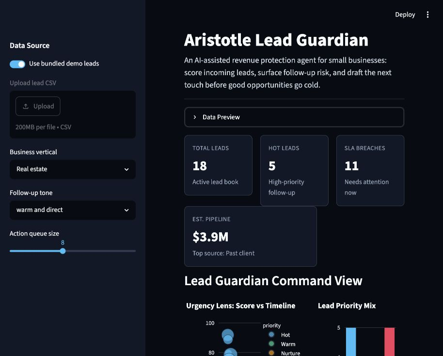
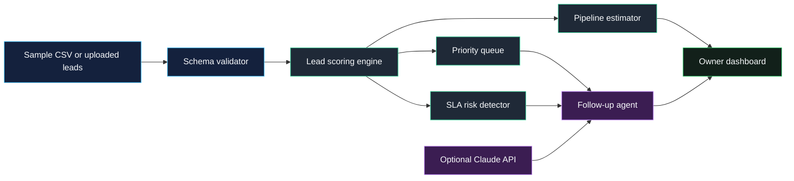

# Aristotle Lead Guardian

[](https://www.python.org/)
[](https://streamlit.io/)
[](https://plotly.com/python/)
[](https://www.anthropic.com/)

**Aristotle Lead Guardian** is a small-business AI agent for protecting revenue from slow follow-up. It ingests a lead list, scores urgency and conversion potential, flags SLA risk, drafts the next outreach touch, and gives the owner or sales team a focused action queue.



The first wedge is real estate, but the data model is intentionally useful for other local-service businesses that live or die by response time: roofing, HVAC, med spas, agencies, consulting, insurance, and high-ticket service providers.

## What It Does

- Loads demo lead data or a CSV uploaded by the user.
- Scores every lead using recency, intent, engagement, budget, timeline, status, and follow-up latency.
- Flags hot leads, aging leads, stale opportunities, and SLA breaches.
- Generates deterministic follow-up drafts without an API key.
- Uses Claude through the Anthropic SDK when `ANTHROPIC_API_KEY` is configured.
- Provides a daily action queue, source quality view, pipeline estimate, and CSV export.

## Architecture



## Quickstart

```bash
cd aristotle-lead-guardian
python -m venv .venv
source .venv/bin/activate
pip install -r requirements.txt
cp .env.example .env
streamlit run dashboard/app.py
```

Claude calls are optional. Without `ANTHROPIC_API_KEY`, the app uses deterministic follow-up copy so the full demo remains runnable.

## CSV Format

The dashboard accepts a basic CSV with these required columns:

| Column | Example | Notes |
|---|---:|---|
| `lead_id` | `L-1001` | Unique lead identifier |
| `created_at` | `2026-06-28` | Lead creation date |
| `name` | `Maya Patel` | Contact name |
| `email` | `maya@example.com` | Contact email |
| `phone` | `415-555-0181` | Contact phone |
| `source` | `Website form` | Lead source or channel |
| `status` | `New` | New, Contacted, Nurture, Appointment, Won, Lost |
| `budget` | `950000` | Estimated deal size or customer budget |
| `intent` | `High` | Ready, High, Medium, Low, Researching |
| `timeline_days` | `14` | Expected buying or decision timeline |
| `last_contacted_at` | `2026-06-29` | Blank is allowed |
| `engagement_score` | `82` | 0-100 behavioral engagement |
| `notes` | `Asked about school district` | Context for the agent |

Optional columns: `assigned_to`, `region`, `service_type`, `preferred_channel`.

## Tests

```bash
pytest -q
```

## Deployment

For Streamlit Community Cloud:

- Repo: `Robertcurzon/aristotle-lead-guardian`
- Branch: `main`
- App path: `dashboard/app.py`
